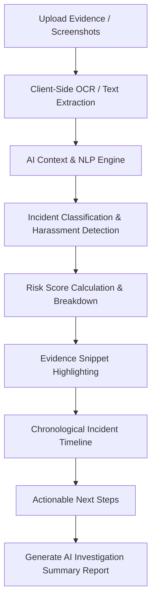
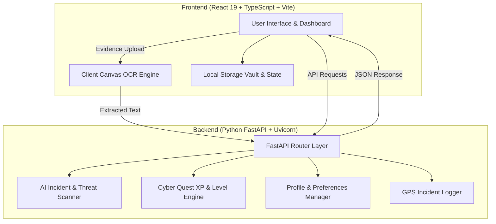

# 🛡️ CyberSaheli — Personal AI Safety OS

> **Detect. Understand. Protect.**


---

## 📌 Project Overview

**CyberSaheli** is a next-generation, AI-powered personal digital safety operating system designed to empower women to detect cyber threats, investigate suspicious digital incidents, understand online risks, preserve evidence securely, and respond instantly to personal safety concerns.

By combining multimodal AI evidence analysis, explainable threat scoring, gamified cyber resilience, and instant local emergency response, CyberSaheli transforms digital safety from a fragmented set of reactive tools into a unified, proactive digital bodyguard.

---

## 🚨 The Problem

Women around the world face an escalating array of digital threats:

- **Online Harassment & Intimidation**: Repeated unwanted messages, abusive comments, and targeted hostility.
- **Cyber Extortion & Blackmail**: Coercion tactics threatening non-consensual media leaks or financial harm.
- **Financial Fraud & UPI Scams**: Fake job offers, lottery traps, and QR code payment scams.
- **Deepfake & Biometric Manipulation**: Voice cloning and synthetic image distortion used to panic victims.
- **Impersonation & Stalking**: Fake social media profiles and unwanted location tracking.
- **Fragmented Emergency Tools**: Victims must use separate tools to verify handles, report crimes, call for help, and store evidence.

---

## 💡 The Solution

CyberSaheli unifies prevention, investigation, education, and emergency response into a single, cohesive **Personal AI Safety Operating System**:

- **DETECT**: Scan links, verify unverified handles/phones, and audit profiles before engaging.
- **UNDERSTAND**: Analyze suspicious conversations and emails with explainable AI threat scores and highlighted risk signals.
- **INVESTIGATE**: Extract evidence text via OCR, build chronological timelines, and generate formal investigation summaries.
- **PRESERVE**: Store sealed evidence records securely in the localized Evidence Vault.
- **LEARN**: Gain real-world cyber threat awareness through "Cyber Quest" interactive gamification.
- **RESPOND**: Dispatch instant emergency SOS actions using real device GPS and direct helpline dialers.

---

## 🔥 Key Features

### 🔍 1. Verify Someone
Analyze suspicious profiles, usernames, phone numbers, URLs, and screenshots before communicating. CyberSaheli performs automated cross-checks and delivers an explainable trust rating.

### 🕵️ 2. Investigate Incident Workspace
Drag and drop chat screenshots, emails, or text logs. The AI engine extracts text via OCR, classifies the incident (Harassment, Threat, Extortion, Scam, Stalking), highlights exact risk snippets, builds a sequence timeline, and generates an AI Investigation Report.

### 🛡️ 3. Evidence Vault
Securely store sealed digital evidence records with cryptographic timestamps. Preserves files, chat exports, and risk summaries for future police or legal reporting.

### 🚨 4. Emergency SOS
Instant dispatch operating system powered by 100% reliable local device actions:
- **Real Device GPS Engine**: Captures exact coordinates (`lat`, `lng`, `accuracy`) and generates direct Google Maps links.
- **Actionable Controls**: One-tap phone dialer (`tel:<phone>`), native location sharing (`navigator.share()`), and clipboard fallback.
- **Verified Helplines**: Direct access to **112** (Police & Emergency Response), **1930** (National Cyber Crime Portal), and **1091** (Women Helpline).

### 📡 5. AI Risk Radar
Real-time cyber threat intelligence hub categorizing emerging scams into Financial Fraud, UPI Scams, Women's Safety Alerts, and Deepfake awareness feeds.

### 🎮 6. Cyber Quest (Gamified Learning)
Duolingo-style cybersecurity training platform with:
- **Levels 1 to 10** (*Beginner* to *CyberSaheli Champion*)
- Server-validated **XP Engine** & transactional XP ledger
- **Streaks, Daily Challenges, Achievements & Skill Tree**

### 🤖 7. Ask Saheli
Contextual AI safety companion supporting **English, Hindi, and Marathi**. Answers questions, explains legal options, and guides users through incident recovery.

### 🪪 8. Safety Passport
Central digital safety identity containing verified emergency contacts, emergency message presets, and identity/medical recovery keys.

### 👤 9. Premium Profile
Personalized cybersecurity command center tracking readiness score (82%), learning achievements, notification preferences, device sessions, and data privacy options.

---

## 🤖 AI Capabilities

CyberSaheli leverages a modular AI architecture to provide explainable safety insights:

- **Multimodal Evidence Processing**: Accepts images, PDFs, text logs, and chat exports.
- **Client-Side Canvas / Tesseract OCR**: Extracts text from screenshots directly inside the browser.
- **Contextual Threat NLP**: Analyzes threat intent, isolation tactics, financial coercion, and escalation patterns.
- **Explainable Risk Scoring**: Generates overall risk scores (0-100) broken down into Harassment, Threat, Escalation, and Coercion scores.
- **Evidence Snippet Highlighting**: Pinpoints exact offending lines of text and explains *why* they pose a risk.
- **Multilingual Support**: Supports English, Hindi, and Marathi for explanations and AI guidance.

---

## 🔄 Investigate Incident Workflow



---

## 🏗️ System Architecture



---

## 💻 Tech Stack

### **Frontend**
- **Core**: React 19, TypeScript, Vite v8.2.0
- **Styling**: Tailwind CSS v4, Framer Motion, Lucide Icons
- **Document & Media Processing**: Tesseract.js, html2canvas, jsPDF, Leaflet

### **Backend**
- **Framework**: Python 3.11+ / FastAPI
- **Server**: Uvicorn ASGI Server
- **Validation**: Pydantic v2, asyncio

---

## 🛠️ Installation & Setup

### Prerequisites
- **Node.js**: v18.0.0 or higher
- **Python**: v3.10 or higher
- **Git**

### 1. Clone Repository
```bash
git clone https://github.com/AnushkaJagtap22/CyberSaheli---Personal-AI-Safety-OS.git
cd CyberSaheli---Personal-AI-Safety-OS
```

### 2. Frontend Setup
```bash
cd frontend
npm install
npm run dev
```
The frontend will start at `http://localhost:5173`.

### 3. Backend Setup
```bash
cd ../backend
pip install -r requirements.txt
python -m uvicorn main:app --host 127.0.0.1 --port 8000 --reload
```
The backend API will start at `http://127.0.0.1:8000`.

---

## 🔒 Security & Data Privacy

- **Local-First Processing**: Sensitive evidence and contact lists remain on the user's device (`localStorage`) unless explicitly exported.
- **Zero Third-Party Dispatch Dependencies**: Emergency SOS relies strictly on browser Geolocation API and native device dialers (`tel:`).
- **Sanitized Backend Logs**: User evidence logs omit passwords, credentials, and authentication tokens.

---

## 🔮 Future Scope

- **Edge On-Device AI Models**: Running lightweight LLMs locally for offline threat detection.
- **Automated FIR Dossier Builder**: One-click formatting of evidence into official police portal complaint formats.
- **Community Safety Network**: Anonymous local threat alerts for recurring scam numbers in specific cities.

---

## 🌟 Hackathon Impact

CyberSaheli bridges the gap between complex cybersecurity concepts and non-technical users, offering a practical, empowering tool built specifically to enhance women's digital safety and personal confidence online.

---

## 📜 License

Distributed under the **MIT License**. See `LICENSE` for more details.
